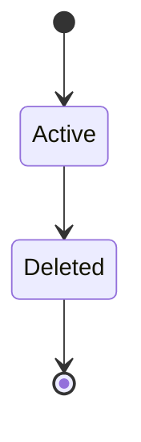
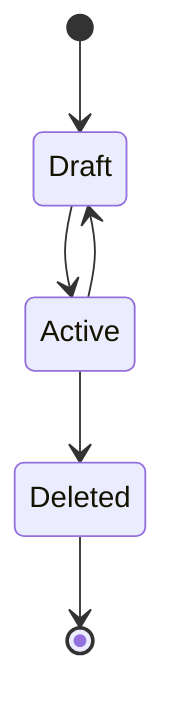

# Data Model

1. [State-Machines](#state-machines)
   1. [Base State-Machine (BSM)](#base-state-machine-bsm)
   1. [User](#user)
   1. [Specialist](#specialist)
   1. [Service](#service)
   1. [Clinic](#clinic)
   1. [ClinicBranch](#clinicbranch)
   1. [Review](#review)
1. [Dictionaries](#dictionaries)
   1. [Speciality](#speciality)
   1. [ServiceType](#servicetype)
   1. [TreatmentProfile](#treatmentprofile)

<!---------------------------
---------AGGREGATES----------
 --------------------------->

## State-Machines

### Base State-Machine (BSM)

This is generic entity for other machines. Other machines can modify BMS lifecycle but must to inherit its attributes.

#### Lifecycle

#### Attributes

| Attribute | Data type |
| :- | :- |
| status * | int |
| status_message | text |
| created_at * | timestamp |
| updated_at * | timestamp |
| author * | User |

### User

#### Lifecycle

#### Attributes

| Attribute | Data type |
| :- | :- |
| name * | text |
| phone * | text |

### Specialist

#### Lifecycle

#### Attributes

| Attribute | Data type |
| :- | :- |
| name * | text |
| photo * | text |
| specialities * | Speciality [] |
| description | text |
| experience * | int |
| education | text |
| courses | text |
| contacts | text [] |
| jobs | text |
| labels | text [] |
| treatment_profiles | TreatmentProfile [] |
| clinics * | ClinicBranch [] |

### Service

#### Lifecycle

#### Attributes

| Attribute | Data type |
| :- | :- |
| type * | ServiceType |
| description | text |
| price | float |
| discount | int |
| specialist * | Specialist |
| clinic_branch * | ClinicBranch |

### Clinic

#### Lifecycle

#### Attributes

| Attribute | Data type |
| :- | :- |
| name * | text |
| description | text |
| photos | text [] |
| references | text [] |
| branches | ClinicBranch [] |

### ClinicBranch

#### Lifecycle

#### Attributes

| Attribute | Data type |
| :- | :- |
| name * | text |
| clinic * | Clinic |
| full_address * | text |
| metro_stations | text [] |
| contacts | text [] |

### Review

#### Lifecycle

#### Attributes

| Attribute | Data type |
| :- | :- |
| visit_date * | timestamp |
| services * | Service [] |
| rating * | int |
| story * | text |
| liked | text |
| not_liked | text |

<!---------------------------
---------DICTIONARIES--------
---------------------------->

## Dictionaries

There is no generic entity

### Speciality

| Attribute | Data type |
| :- | :- |
| code * | int |
| name * | text |

### ServiceType

| Attribute | Data type |
| :- | :- |
| code * | int |
| name * | text |
| specialist | bool |
| clinic | bool |
| description | text |
| is_active | bool |

### TreatmentProfile

| Attribute | Data type |
| :- | :- |
| code * | int |
| name * | text |
| description | text |
