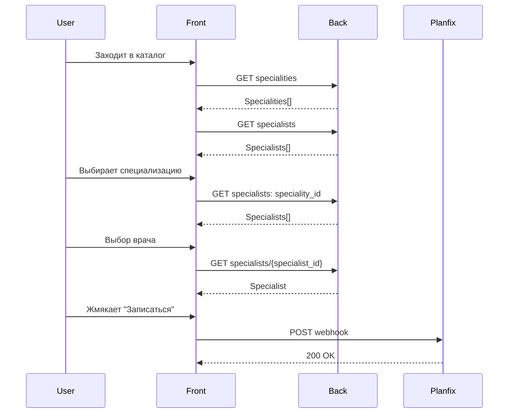

# Release 1

## Концепция

Первый релиз содержит каталог врачей с возможностью фильтра по специализации и карточку врача

*ПРОШУ ОБРАТИТЬ ВНИМАНИЕ НА ИЗМЕНЕНИЯ В СТАТУСНОЙ МОДЕЛИ, У МНОГИХ СУЩНОСТЕЙ УШЕЛ СТАТУС ЧЕРНОВИКА*

## Сценарии

1. Пользователь по ссылке переходит в каталог врачей
1. Пользователь выбирает специализацию врача
1. Пользователь просматривает врачей в каталоге
1. Пользователь переходит в катрочку врача из бота или из каталога
1. Пользователь просматривает информацию по врачу
1. Пользователь нажимает "Записаться"
   1. Заполняет Фамилию и имя
   1. Номер телефона
   1. Желаемое время записи (текстом в произвольной форме)

## To-be sequence diagram



## Main APP

### Front

1. Дизайн интерфейса по ссылке https://www.figma.com/file/pN2des2mNquE5neb52BPff/Medical-Aggregator-(Copy)?node-id=0%3A1&t=PG3LN3crGpbboKAS-1
1. Если у специалиста не заполнен рейтинг, то не не отображаем его в карточке и каталоге у врача
1. Если у врача не заполнена информация из следующих блоков, то не отображаем этот блок
   1. Описание
   1. Образование
   1. Курсы
   1. Опыт работы
1. Если у врача не указаны услуги, то их тоже не отображаем. Только кнопку "Записаться"
1. По нажатию на кнопку "Записаться" появляется всплывающее окно с полями
   1. Заголовок "Запись к врачу"
   1. Ваши фамилия и имя
   1. Ваш номер телефона
   1. Желаемое время записи. (Укажите в свободной форме. Например: "сегодня" или "до конца месяца")
   1. Кнопки "Записаться" и "Отмена"
1. Номер телефона валидируется регуляркой, что он азербайджанский. Пример: +994 50 765 35 76
1. После нажатия кнопки "Записаться" отправляется вебхук Planfix
   1. POST https://doctoraz.planfix.ru/webhook/json/sa90-nmmq-o0ka-meuj
   1. Body
   
   ```json
   {
      "full_name": text,
      "phone": text,
      "visit_date": text
   }
   ```

### Back

none

### Миграция данных

tbd из excel

## CP (Админка, которой пока нет)

### Front

none

### Back

none
